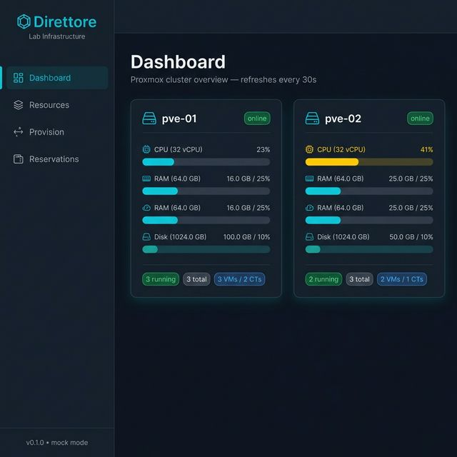
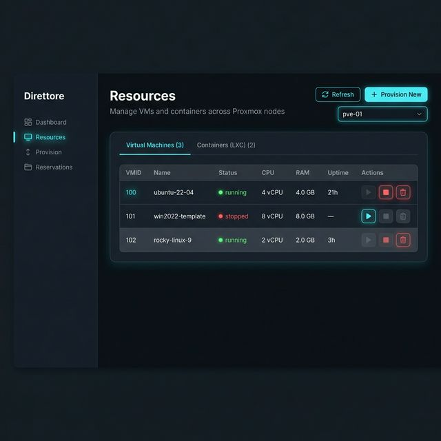
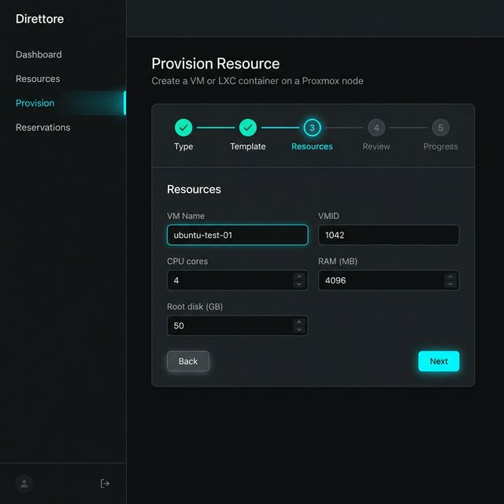
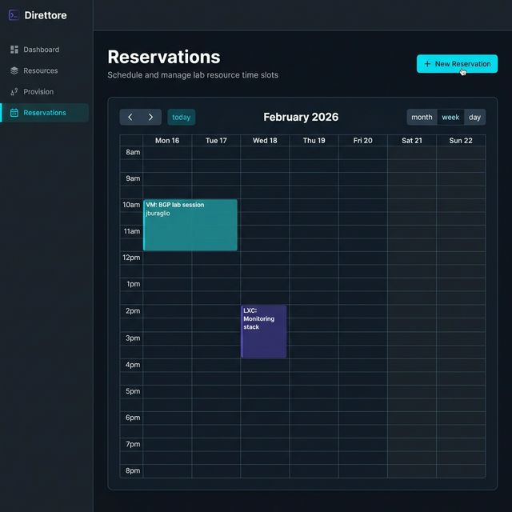

# Direttore — Lab Infrastructure Management Platform

A vendor-agnostic network and compute lab automation platform combining **NetBox** inventory, **Nornir** network device configuration, and a modern **React + FastAPI** web interface for provisioning and reserving Proxmox VMs and LXC containers.

---

## Architecture

```
┌─────────────────────────────────────────────────────────┐
│                   React Frontend (Vite)                 │
│   Dashboard · Resources · Provision Wizard · Calendar   │
└──────────────────┬────────────────────────────┬─────────┘
                   │ REST API                   │
┌──────────────────▼────────────────────────────▼─────────┐
│                  FastAPI Backend (api/)                  │
├─────────────┬────────────────┬──────────────────────────┤
│  Proxmox    │  Reservations  │      NetBox Proxy        │
│  (proxmoxer)│  (SQLAlchemy)  │      (httpx)             │
└─────────────┴────────────────┴──────────────────────────┘
        │                                      │
  Proxmox VE API                         NetBox API
  (QEMU VMs + LXC)                  (Device inventory)

                    + Nornir pipeline (existing)
                    + Git-backed config storage (existing)
```

---

## Web UI Features

### Dashboard
Real-time cluster overview — one card per Proxmox node showing CPU, RAM, and disk utilization with auto-refresh every 30 seconds.

### Resources
Browse all VMs and LXC containers across nodes. Start, stop, and delete resources directly from the table.

### Provision Wizard
6-step wizard to provision a new VM or LXC container:
1. **Type** — choose VM (QEMU/KVM) or LXC Container, select target node
2. **Template** — select ISO or container template from node storage
3. **Resources** — set name, VMID, CPU cores, RAM, disk size
4. **Network & Storage** — configure storage pool and network interfaces:
   - **Storage**: select from available Proxmox storage pools (shows type and free space)
   - **NICs**: add up to 8 network interfaces per VM/LXC — each with:
     - Bridge selection (live list from the node's configured bridges)
     - Optional VLAN ID (1–4094; empty = untagged)
     - NIC model (VMs: VirtIO / E1000 / RTL8139)
     - IP address mode (LXC: `dhcp` or static CIDR)
5. **Review** — confirm all settings including per-NIC summary table
6. **Progress** — live task progress bar polling the Proxmox UPID

### Reservation Calendar
FullCalendar week/month/day view. Click any time slot to reserve a resource window. Conflict detection prevents double-booking the same node.

---

## Screenshots

### Dashboard


### Resource Browser


### Provision Wizard (Step 3 — Resources)


### Reservation Calendar


---

## Prerequisites

- Python 3.11+ (backend)
- Node.js 20+ (frontend)
- A Proxmox VE host, **or** use `PROXMOX_MOCK=true` for development without hardware
- NetBox instance (optional — only needed for the inventory proxy routes)

---

## Installation & Setup

### 1. Clone and branch

```bash
git clone <repo-url>
cd direttore
git checkout feature/react-fastapi-frontend
```

### 2. Configure environment

```bash
cp .env.example .env
# Edit .env with your Proxmox host, credentials, and NetBox token
# Set PROXMOX_MOCK=true for development without real hardware
```

### 3. Backend setup

```bash
python3 -m venv .venv
source .venv/bin/activate
pip install -r requirements-api.txt

# Start the API server
PROXMOX_MOCK=true uvicorn api.main:app --reload --port 8000
```

API docs available at **http://localhost:8000/docs**

### 4. Frontend setup

```bash
cd frontend
npm install
npm run dev
```

Frontend available at **http://localhost:5173**

---

## Environment Variables

| Variable | Default | Description |
|---|---|---|
| `PROXMOX_HOST` | `192.168.1.100` | Proxmox VE hostname or IP |
| `PROXMOX_USER` | `root@pam` | Proxmox API user |
| `PROXMOX_PASSWORD` | — | Proxmox API password |
| `PROXMOX_VERIFY_SSL` | `false` | Verify TLS certificate |
| `PROXMOX_MOCK` | `false` | Use mock data (no real Proxmox needed) |
| `NETBOX_URL` | `http://localhost:8000` | NetBox base URL |
| `NETBOX_TOKEN` | — | NetBox API token |
| `DATABASE_URL` | `sqlite+aiosqlite:///./direttore.db` | SQLAlchemy async DB URL |
| `API_CORS_ORIGINS` | `http://localhost:5173,...` | Comma-separated allowed CORS origins |

---

## API Reference

### Proxmox Endpoints

| Method | Path | Description |
|---|---|---|
| `GET` | `/api/proxmox/nodes` | List nodes with CPU/RAM/disk stats |
| `GET` | `/api/proxmox/nodes/{node}/networks` | List bridge interfaces on a node |
| `GET` | `/api/proxmox/nodes/{node}/storage` | List storage pools that support VM/CT disks |
| `GET` | `/api/proxmox/nodes/{node}/vms` | List QEMU VMs |
| `POST` | `/api/proxmox/nodes/{node}/vms` | Create a VM (supports multi-NIC, VLAN, storage selection) |
| `POST` | `/api/proxmox/nodes/{node}/vms/{vmid}/{action}` | start / stop / reboot / shutdown / delete |
| `GET` | `/api/proxmox/nodes/{node}/lxc` | List LXC containers |
| `POST` | `/api/proxmox/nodes/{node}/lxc` | Create a container (supports multi-NIC, VLAN, storage selection) |
| `POST` | `/api/proxmox/nodes/{node}/lxc/{vmid}/{action}` | start / stop / reboot / shutdown / delete |
| `GET` | `/api/proxmox/nodes/{node}/templates` | List available ISOs and templates |
| `GET` | `/api/proxmox/tasks/{node}/{upid}` | Poll task status by UPID |

#### VM creation request body (`POST /api/proxmox/nodes/{node}/vms`)

```json
{
  "vmid": 1042,
  "name": "my-vm",
  "cores": 2,
  "memory": 2048,
  "disk": "32G",
  "storage": "local-lvm",
  "iso": "local:iso/ubuntu-22.04.4-live-server-amd64.iso",
  "nics": [
    { "bridge": "vmbr0", "model": "virtio", "vlan": null },
    { "bridge": "vmbr1", "model": "e1000", "vlan": 100 }
  ]
}
```

#### LXC creation request body (`POST /api/proxmox/nodes/{node}/lxc`)

```json
{
  "vmid": 3001,
  "hostname": "my-container",
  "cores": 1,
  "memory": 512,
  "storage": "local-lvm",
  "disk_size": 8,
  "template": "local:vztmpl/ubuntu-22.04-standard_22.04-1_amd64.tar.gz",
  "nics": [
    { "name": "eth0", "bridge": "vmbr0", "ip": "dhcp", "vlan": null },
    { "name": "eth1", "bridge": "vmbr1", "ip": "10.10.100.5/24", "gw": "10.10.100.1", "vlan": 200 }
  ],
  "password": "changeme",
  "unprivileged": true,
  "start_after_create": true
}
```

### Reservation Endpoints

| Method | Path | Description |
|---|---|---|
| `GET` | `/api/reservations/` | List reservations (filterable by `?start=&end=`) |
| `POST` | `/api/reservations/` | Create reservation (conflict check included) |
| `GET` | `/api/reservations/{id}` | Get a single reservation |
| `PATCH` | `/api/reservations/{id}` | Update a reservation |
| `DELETE` | `/api/reservations/{id}` | Cancel a reservation |
| `GET` | `/api/reservations/export/ical` | iCAL feed for calendar apps |

### Inventory Endpoints (NetBox proxy)

| Method | Path | Description |
|---|---|---|
| `GET` | `/api/inventory/devices` | Proxy NetBox device list |
| `GET` | `/api/inventory/prefixes` | Proxy NetBox IP prefix list |

---

## nginx Reverse Proxy

Example configs live in [`docs/nginx/`](docs/nginx/):

| File | Purpose |
|---|---|
| [`direttore.conf`](docs/nginx/direttore.conf) | Main server block (HTTP + HTTPS variants) |
| [`websocket_map.conf`](docs/nginx/websocket_map.conf) | `map` block required for WebSocket/HMR support — goes in `http {}` context |

### URL routing

| Path prefix | Upstream |
|---|---|
| `/api/*` | FastAPI backend — `127.0.0.1:8000` |
| `/docs`, `/redoc`, `/openapi.json` | FastAPI Swagger/ReDoc (from backend) |
| `/` (everything else) | React frontend — `127.0.0.1:5173` |

Vite's HMR WebSocket is served on the same port as the dev server and is handled transparently via the `$connection_upgrade` map — no separate path needed.

> [!IMPORTANT]
> **Vite host check** — Vite's dev server rejects any request whose `Host` header isn't `localhost`/`127.0.0.1`. When nginx proxies from a real hostname (e.g. `netserv.example.com`), Vite returns an *"Invalid Host header"* error. The `vite.config.js` in this repo already sets `allowedHosts: 'all'` and `host: '0.0.0.0'` to fix this. If you see a blank page or that error, make sure the Vite dev server was **restarted** after the config change.

### Install (bare-metal)

```bash
# 1. Install the map snippet (http context — required for WebSocket support)
sudo cp docs/nginx/websocket_map.conf /etc/nginx/conf.d/

# 2. Install the site config
sudo cp docs/nginx/direttore.conf /etc/nginx/sites-available/direttore
sudo ln -s /etc/nginx/sites-available/direttore /etc/nginx/sites-enabled/

# 3. Edit server_name + certificate paths, then validate and reload
sudo nginx -t && sudo systemctl reload nginx
```

> **No TLS yet?** `direttore.conf` includes a commented-out plain HTTP server block at the bottom — use that for internal networks or staging.

> **Docker Compose:** replace `127.0.0.1:8000` / `127.0.0.1:5173` with `api:8000` / `frontend:80` and add `resolver 127.0.0.11 valid=10s;` inside the server block.

---

## Docker Compose (Local Dev)

```bash
cp .env.example .env   # set PROXMOX_MOCK=true
docker compose up
```

- API: **http://localhost:8000**
- Frontend: **http://localhost:5173**

---

## Project Structure

```
direttore/
├── api/                      # FastAPI backend
│   ├── main.py               # App entrypoint, CORS, lifespan
│   ├── config.py             # Pydantic-settings from .env
│   ├── db.py                 # Async SQLAlchemy engine
│   ├── models.py             # Reservation, ResourcePool ORM models
│   ├── proxmox/
│   │   ├── client.py         # proxmoxer wrapper + mock data (nodes, VMs, LXC, networks, storage)
│   │   ├── vms.py            # QEMU VM CRUD
│   │   ├── containers.py     # LXC container CRUD
│   │   ├── templates.py      # ISO/template listing
│   │   ├── network.py        # Bridge interface listing
│   │   └── storage.py        # Storage pool listing
│   └── routes/
│       ├── proxmox.py        # /api/proxmox/* routes (incl. /networks, /storage)
│       ├── reservations.py   # /api/reservations/* routes
│       └── inventory.py      # /api/inventory/* routes
├── frontend/                 # React + Vite SPA
│   ├── src/
│   │   ├── api/              # Axios client + typed API functions
│   │   ├── components/
│   │   │   └── Layout.jsx    # Sidebar navigation
│   │   └── pages/
│   │       ├── Dashboard.jsx     # Node cards + resource bars
│   │       ├── Resources.jsx     # VM/CT table with actions
│   │       ├── Provision.jsx     # 5-step provisioning wizard
│   │       └── Reservations.jsx  # FullCalendar + booking modal
│   └── Dockerfile.frontend
├── templates/                # Jinja2 network config templates
│   ├── junos/, arista/, panos/, nokia-sros/, mikrotik/
│   └── html/                 # Legacy Flask template (superseded)
├── nornir-examples/          # Nornir task examples
├── inventory.py              # Nornir + NetBox inventory plugin
├── deploy.py                 # Git-backed config deployment
├── scheduler.py              # Legacy iCAL scheduler (superseded by API)
├── requirements-api.txt      # Backend Python dependencies
├── Dockerfile.api            # Backend Docker image
├── docker-compose.yml        # Full-stack local dev
└── .env.example              # Environment variable template
```

---

## Connecting a Real Proxmox Host

1. Set `PROXMOX_MOCK=false` (or remove the flag) in `.env`
2. Fill in `PROXMOX_HOST`, `PROXMOX_USER`, `PROXMOX_PASSWORD`
3. If using a self-signed certificate, set `PROXMOX_VERIFY_SSL=false`
4. Ensure the Proxmox user has `VM.Allocate`, `VM.PowerMgmt`, `Datastore.Allocate` privileges

```bash
# Proxmox — create a dedicated API user (recommended over root)
pveum role add DirettoreRole -privs "VM.Allocate VM.PowerMgmt VM.Console Datastore.AllocateSpace Pool.Allocate"
pveum user add direttore@pve --password <password>
pveum aclmod / -user direttore@pve -role DirettoreRole
```

---

## Existing Nornir Workflow

The original network automation pipeline is unchanged and can be used alongside the new web UI:

```bash
source .venv/bin/activate

# List all devices from NetBox
nr-inventory --list

# Deploy BGP config to Juniper devices
python deploy.py --groups juniper
```

---

## Roadmap

| Feature | Effort |
|---|---|
| RBAC / Auth (Auth0 or local) | 10 hrs |
| Real-time VM console (xterm.js + WebSocket) | 15 hrs |
| Snapshot management UI | 5 hrs |
| Prometheus metrics endpoint | 8 hrs |
| Two-way iCAL sync (CalDAV) | 8 hrs |
| YANG config validation | 5 hrs |

---

## Contributing

1. Fork the repository
2. Create a feature branch: `git checkout -b feature/my-change`
3. Commit your changes: `git commit -m 'Add my change'`
4. Push and open a pull request

> **Note**: Set `PROXMOX_MOCK=true` during development so no Proxmox hardware is required.
